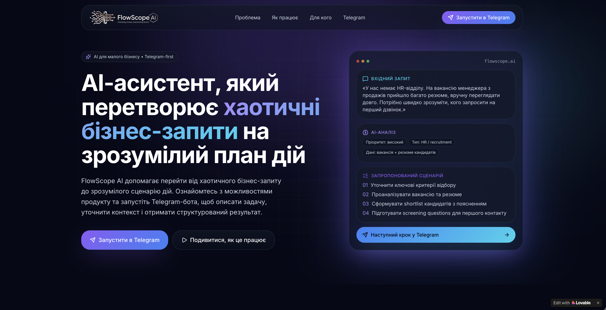
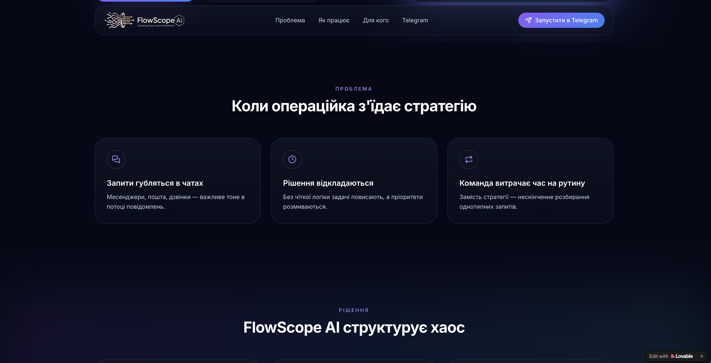
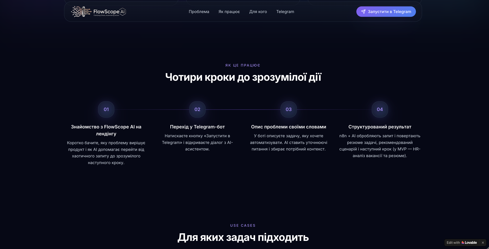
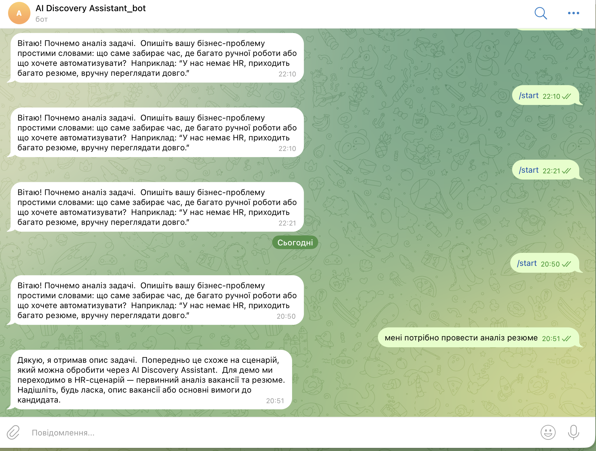
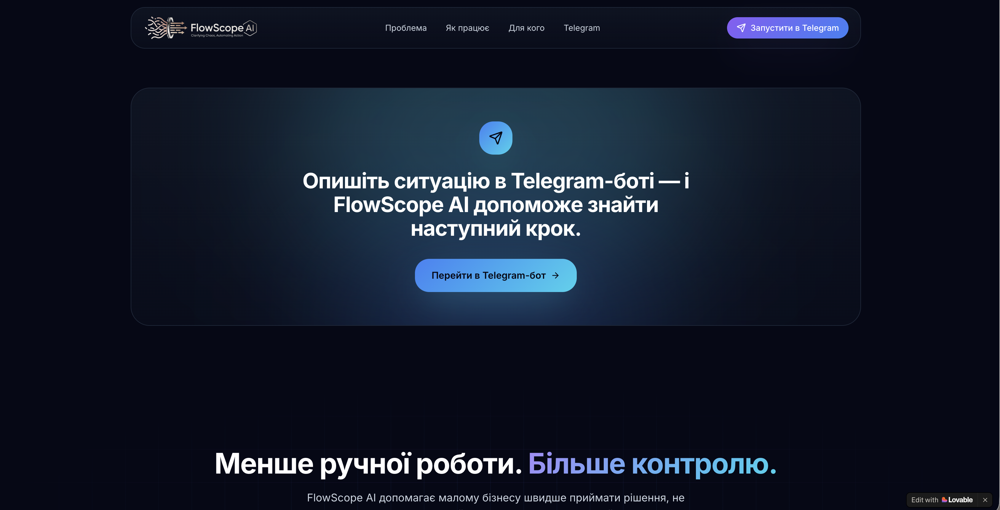

# FlowScope AI

FlowScope AI is a Telegram-first AI assistant for small businesses that helps turn chaotic business requests into structured next steps.  
The first hackathon MVP branch demonstrates AI-powered CV screening, where the assistant clarifies the hiring problem, routes the request into an HR workflow, and returns ranked candidates with explanations.

## Links

- Landing page: [flowscope-ai-launchpad.lovable.app](https://flowscope-ai-launchpad.lovable.app/)
- Telegram bot: [FlowScopeAI_bot](https://t.me/FlowScopeAI_bot)

## Problem

Small businesses often operate without separate HR, operations, or automation teams. Owners and managers have to deal with hiring, client communication, internal processes, and operational requests at the same time.

As a result:

- important requests get lost in chats, email threads, and calls
- decisions are delayed because the next step is unclear
- teams spend too much time on repetitive manual work
- strong job candidates can get lost in the CV flow
- hiring becomes slow, inconsistent, and hard to scale

FlowScope AI is designed to reduce that operational chaos by helping businesses describe a problem in plain language and receive a structured action path.

## Solution

FlowScope AI accepts a raw business request, clarifies the context, identifies the task type, and routes the user to a relevant AI workflow.

In the current MVP, the product demonstrates one concrete scenario:

- AI-powered CV screening and candidate ranking

The user describes the hiring problem, the assistant gathers the missing context, identifies the case as recruitment, and then produces a practical output:

- ranked candidate list
- transparent scoring by criteria
- summaries for each CV
- skills gaps
- shortlist recommendations
- screening questions for top candidates

## Why It Matters

The project addresses two connected problems:

1. Small businesses struggle to translate messy business requests into clear next steps.
2. Recruitment in SMBs is often manual, slow, and handled by non-HR staff.

Verified market context used in the pitch:

- 58% of enterprises in Ukraine reported difficulty finding qualified employees. Source: [Ministry of Economy of Ukraine / UNN](https://unn.ua/en/news/about-60percent-of-entrepreneurs-have-a-problem-finding-qualified-employees-ministry-of-economy), June 4, 2024.
- 43% of businesses already faced difficulties filling vacancies in 2024. Source: [Ministry of Economy of Ukraine / UNN](https://unn.ua/en/news/about-60percent-of-entrepreneurs-have-a-problem-finding-qualified-employees-ministry-of-economy), June 4, 2024.
- 96% of small businesses planned to hire within the next six months. Source: [Wizehire Small Business Growth Statistics](https://wizehire.com/small-business-growth-statistics), 2024.
- 30% of SMB owners said that finding suitable applicants was time-consuming. Source: [Wizehire Small Business Growth Statistics](https://wizehire.com/small-business-growth-statistics), 2024.
- 43% of organizations already use AI in HR tasks. Source: [SHRM Talent Trends 2025](https://www.shrm.org/topics-tools/research/2025-talent-trends/ai-in-hr), 2025.

## What Works in the MVP

- landing page that explains the value proposition and routes users into Telegram
- Telegram-first entry point
- raw business problem intake
- clarification questions from the assistant
- task classification and routing into the HR branch
- vacancy / candidate requirement intake
- CV screening scenario with structured output logic
- automation orchestration through n8n
- report and artifact generation through Google Docs / Google Sheets

## User Flow

1. A user opens the landing page and understands the product value.
2. The user clicks `Launch in Telegram`.
3. The Telegram bot asks the user to describe the business problem in plain language.
4. FlowScope AI analyzes the request and asks clarification questions.
5. The system classifies the request and routes it to the most relevant workflow.
6. In the MVP demo, the request is routed into the recruitment screening scenario.
7. The assistant asks for a vacancy description or candidate requirements.
8. The system processes the hiring request and returns a structured result with a recommended next step.

More detail: [docs/demo-flow.md](docs/demo-flow.md)

## How to Test

1. Open the landing page.
2. Click "Launch in Telegram".
3. Start the bot with /start.
4. Describe a hiring problem, for example:
   "Потрібно знайти кандидата для AI automation / n8n workflow specialist."
5. Answer the clarification question.
6. Receive ranked candidate recommendations.

## Demo Limitations

The current MVP demonstrates one working HR / recruitment scenario.
Other business workflow branches are planned for future development.
The candidate database is currently prepared for demo purposes.

## Product Differentiation

FlowScope AI is not positioned as just another CV sorter.

What makes it different:

- it starts with the business problem, not with a file upload
- it is designed for SMB teams that do not have dedicated HR or automation specialists
- it combines clarification, classification, routing, and decision support in one Telegram-first experience
- it aims to make AI practical for daily business operations, not only for one isolated task
- it uses explainable scoring logic instead of a black-box recommendation

## Tech Stack

- Frontend / Landing: Lovable
- User Interface: Telegram Bot
- Automation Layer: n8n
- AI Core: OpenAI API
- Data Storage: Google Sheets
- Report Generation: Google Docs
- Repository: GitHub
- Demo Access: Lovable public link + Telegram bot

## Demo Database

The MVP uses a Google Sheets-based candidate database:
[Google Sheets demo database](https://tinyurl.com/bde46s63)


## Workflow Example

This repository also includes an example n8n workflow used in the FlowScope AI MVP:

[View n8n workflow example](./workflows/flowscope-ai-workflow.example.json)


## Screenshots

### Landing Hero



### Problem Section



### How It Works



### Telegram Bot Entry



### Final CTA



## Repository Structure

```text
.
├── README.md
├── workflows/
│   └── flowscope-ai-workflow.example.json
├── assets/
│   └── screenshots/
│       ├── bot-chat.png
│       ├── flowscope-ai-workflow.png
│       ├── landing-cta.png
│       ├── landing-hero.png
│       ├── landing-how-it-works.png
│       └── landing-problem.png
└── docs/
    ├── architecture.md
    ├── demo-flow.md
    ├── flowscope_pricing_and_savings.md
    ├── mvp-scope.md
    ├── product-overview.md
    └── team.md
```

## Team

- Oleksandr Horobynskyi — Data Analyst
- Yevgeniia Ludchenko — UI/UX Designer
- Eduard Kurish — AI Automation & Workflow Specialis, QA
- Tetyana Kavatsyuk — AI Content Maker
- Yuliana Dolhyi — UI/UX Designer
- Dmytro Zinchenko — AI No-Code
- Noga Ivan — Data Analyst
- Mykhaylo Gorbatov — PM

More detail: [docs/team.md](docs/team.md)

## Future Development

After the MVP, FlowScope AI can expand into a broader small-business decision assistant platform.

Planned directions:

- lead qualification workflows
- client request triage
- internal operations analysis
- identification of automation opportunities
- financial / operational intake scenarios
- reusable workflow library for common SMB requests
- lightweight admin dashboard for managing history, outputs, and routing analytics

## Hackathon Context

This repository documents the FlowScope AI project built for GoIT AI Solutions Hackathon 2026.

The current public artifact is documentation-first because the MVP was assembled through Lovable, Telegram, n8n, and cloud tools rather than a traditional codebase.
